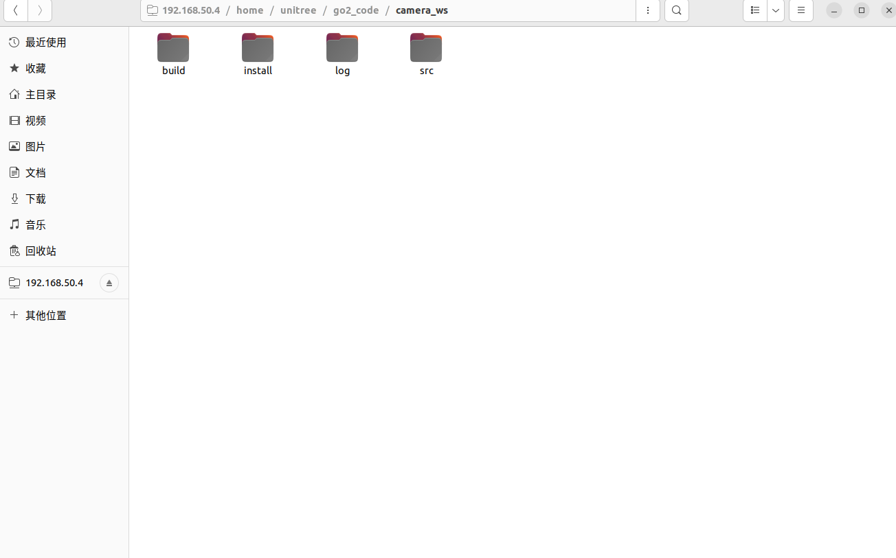

这个文件夹中是lcx和yzx在1.16-1.20中所尝试用unitree go2 进行建图导航的尝试

## 待解决的问题

- [ ] d435i的配置
- [ ] 导航


## 设备记录
### 主机
主要在主机（华硕 ubuntu22 4070）上运行，性能更好，运算更快。
主要的代码都在这里

主机连接扩展坞，机器狗上的wifi是`EILLM`时，地址是`192.168.50.4`，可以正常连接；

如果为wifi是`CS_INF`时，ip是`192.168.123.194`，但是不知道为什么，这里没有办法ssh连接。

### 扩展坞
机器狗扩展坞，连接显示屏，键鼠会卡顿。所以在主机上把程序跑好再在机器狗上运行。

机器狗的扩展坞上尽量不要跑rviz/仿真。如果需要看rviz的效果图，就首先注释调机器狗上开启rviz的地方，然后把主机和扩展坞连接到同一个网段，主机上面就可以显示了。


### 摄像头d435i
安装后出现这样的报错。
需要解决

```bash
[WARN] [1737445295.216427139] [camera.camera]: No RealSense devices were found!
```
文件夹的位置在




在unitree官方的文档中并没有看到如何使用的地方

安装参考[realsense官方](https://github.com/IntelRealSense/realsense-ros?tab=readme-ov-file)

！不要使用`sudo apt install ros-foxy-realsense2-camera
`

#### 安装sdk
参考 https://github.com/IntelRealSense/librealsense/blob/master/doc/installation_jetson.md 

#### install Intel® RealSense™ ROS2 wrapper

只能下载源码编译。


### 内置摄像头